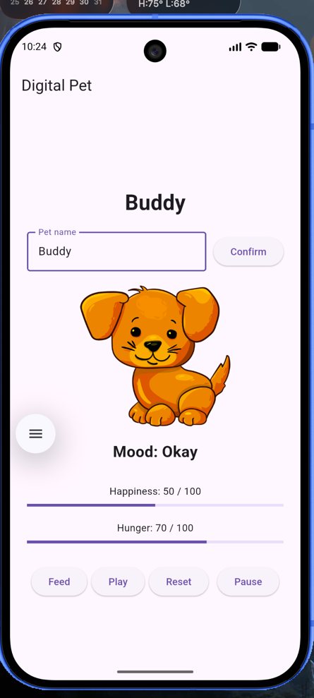
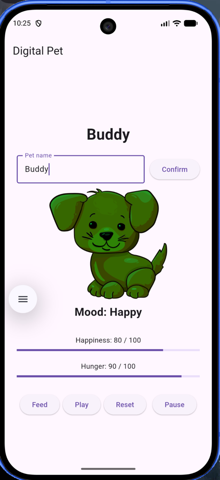
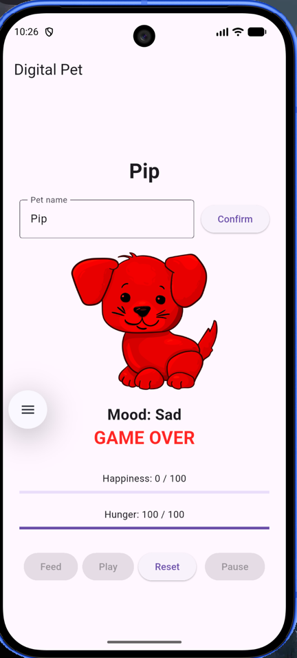

# Digital Pet

## About

This is my Digital Pet app for In-Class Activity 07. I completed the activity individually / Solo. The app uses Flutter state to keep track of the pet's name, happiness, hunger, game status, and session status.

I still used GitHub issues, a separate feature branch, commits, and a pull request even though I worked alone so I could follow the GitHub workflow used in the activity.

## Undergraduate Pathway

I completed the core app and selected these two advanced features:

1. Session Controls
2. Visual Polish & Accessible Motion

## Core Features

- Editable pet name
- Happiness and hunger values from 0 to 100
- Feed, Play, and Reset actions
- Hunger increases by 5 every 30 seconds
- Pet mood changes based on happiness
- Red, yellow, and green mood tint using ColorFiltered
- Visible mood text so color is not the only feedback
- Win when happiness stays above 80 for 3 continuous minutes
- Game over when hunger reaches 100 and happiness is 10 or lower

## Advanced Features

### Session Controls

The Pause button pauses the session and stops the timers. Feed and Play are disabled while paused. Resume starts the session and hunger timer again. Reset restores the pet to its starting state.

### Visual Polish & Accessible Motion

I used AnimatedScale so the pet grows when its happiness is above 70. I also used TweenAnimationBuilder so the happiness and hunger progress bars move smoothly when their values change.

The animations check MediaQuery.of(context).disableAnimations. If reduced motion is enabled, the animation duration becomes zero.

## Pet Rules

- Starting happiness: 50
- Starting hunger: 50
- Play: happiness +10 and hunger +5
- Feed: hunger -10
- If the resulting hunger after feeding is below 30, happiness decreases by 20.
- Otherwise, feeding increases happiness by 10.
- All meter values stay between 0 and 100.

## Manual Testing

| Test | Result |
| --- | --- |
| Feed and Play | Values changed correctly and stayed between 0 and 100 |
| Reset | Returned happiness and hunger to 50 |
| Happiness 29 | Sad mood and red pet |
| Happiness 30 | Okay mood and yellow pet |
| Happiness 70 | Okay mood and yellow pet |
| Happiness 71 | Happy mood and green pet |
| Hunger 95 to 100 | Reached 100 without reducing happiness |
| Hunger overflow at 100 | Hunger stayed at 100 and happiness decreased by 20 |
| Game over | Appeared at hunger 100 and happiness 10 |
| Win condition | Win appeared after happiness stayed above 80 for the test duration |
| Win timer cancellation | Dropping happiness to 80 or below canceled the pending win |
| Pause | Hunger stopped changing and Feed/Play were disabled |
| Resume | Hunger timer and controls resumed |

For testing the win condition, I temporarily shortened the three-minute timer and restored it to three minutes after testing.

## Feature to Learning Outcome

| Feature | What I practiced |
| --- | --- |
| Pet state and meters | StatefulWidget, State, and setState() |
| Feed and Play | Updating related state values |
| Hunger and win timers | Timer lifecycle and dispose() |
| Mood tint | Derived state and ColorFiltered |
| Session controls | Safely pausing and restarting timers |
| Visual polish | Flutter animations and reduced-motion accessibility |
| Editable pet name | TextEditingController and lifecycle cleanup |

## Screenshots

### Normal State


### Happy State


### Game Over


### Issues

- [Issue #1 - Pet state and actions](https://github.com/m-beamlak04/digital_pet/issues/1)
- [Issue #2 - Timers and win/loss](https://github.com/m-beamlak04/digital_pet/issues/2)
- [Issue #3 - Pet mood and appearance](https://github.com/m-beamlak04/digital_pet/issues/3)
- [Issue #4 - Advanced features](https://github.com/m-beamlak04/digital_pet/issues/4)

### Pull Request

- [Pull Request #5 - Complete digital pet core and advanced features](https://github.com/m-beamlak04/digital_pet/pull/5)

## Pet Image

The pet image used in this app is the "Cartoon Puppy" image from Openclipart. The image is listed as public domain.

Source: https://openclipart.org/detail/330305/cartoon-puppy

## Setup and Run

```bash
flutter pub get
flutter run
